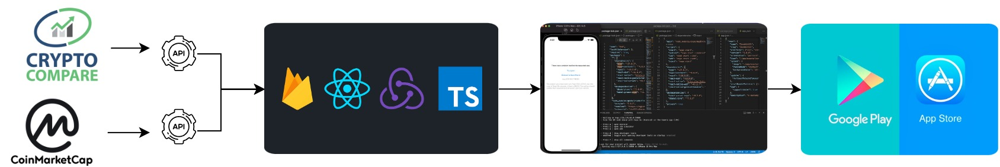
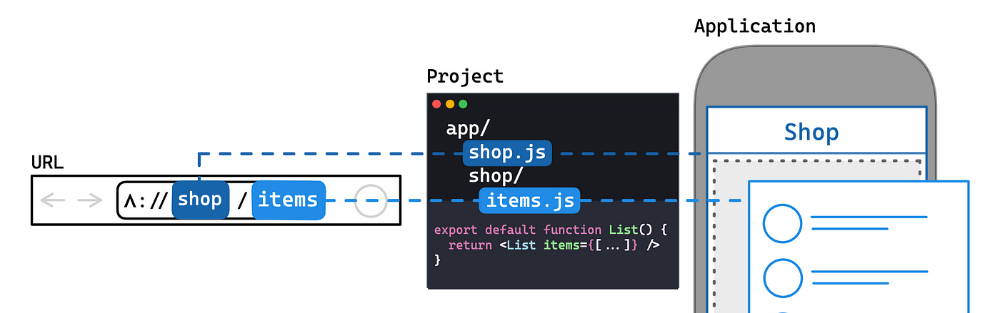
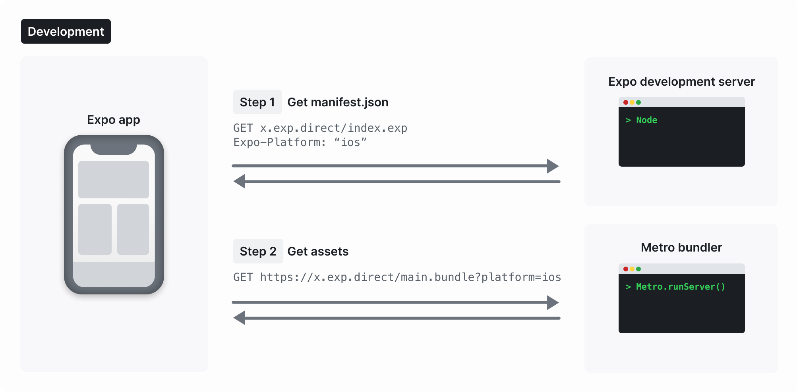
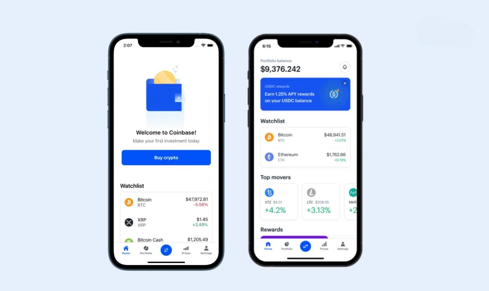
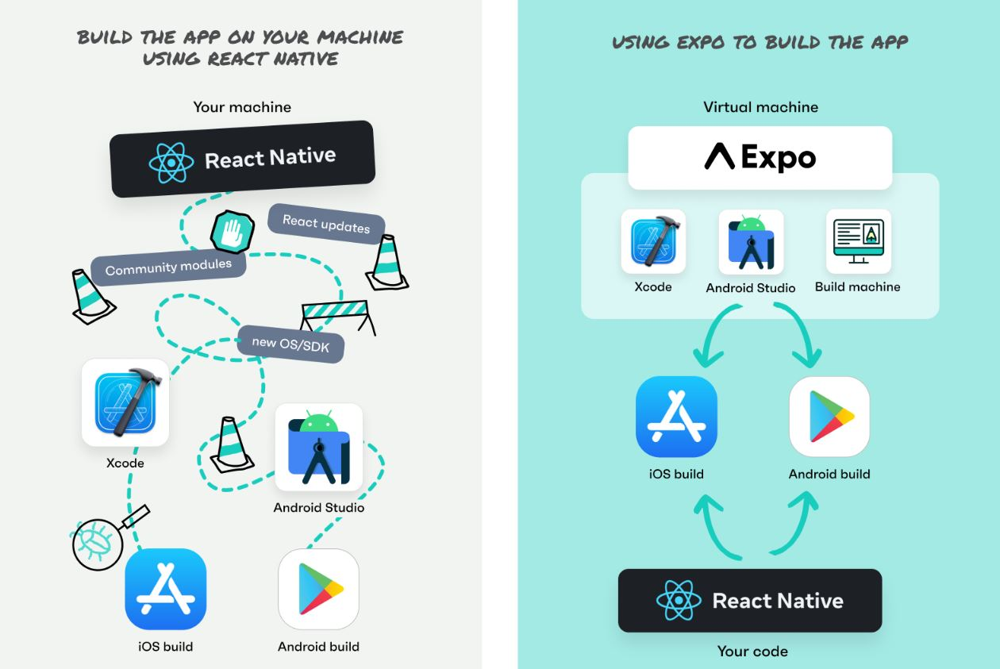

# Coinbase Crypto Wallet Clone

Own Your Crypto Journey - Empowering You to Navigate the Future of Finance

Whether you're a seasoned investor or just starting your journey, our app provides the tools you need to stay informed, make smart investment choices, and watch your stocks soar to new heights.

Track prices, monitor watchlists, and stay up-to-date with the latest news - all in the palm of your hand. Start maximizing your investment potential today!

With our app, you can easily track the prices of your favorite stocks and cryptocurrencies. Simply enter the stock symbols or company names, and our tracker will provide you with the latest price information.

Dive deeper into market trends with historical data and intuitive charts, helping you analyze the performance and identify potential opportunities.

Create personalized watchlists tailored to your investment preferences. Add your favorite stocks or the ones you're closely monitoring, and let our tracker keep you updated in real-time.

Receive instant alerts and notifications for any changes in prices or significant developments, ensuring you never miss a beat.

 

Stay ahead of the game with our comprehensive news and insights section. Access the latest news articles, company announcements, earnings reports, and expert analyst opinions all in one place.

Our curated news feeds provide you with valuable market insights, empowering you to make informed decisions based on the factors influencing stock prices.

## Downloading the app

To install the application to your own system:

- `cmd` within the folder path to open a desired location to save

- `git clone https://github.com/JoexTitan/Crypto-Price-Tracker.git`

- `npm install` -> `npm run build` -> `npm start`

